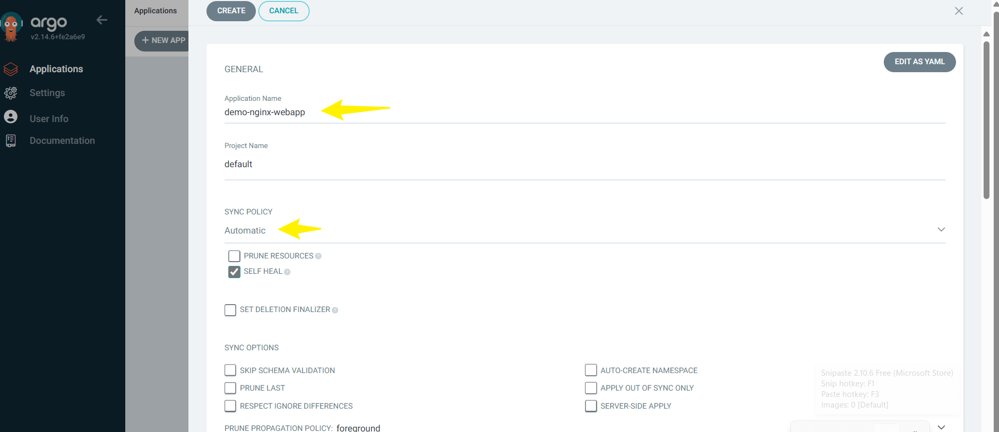
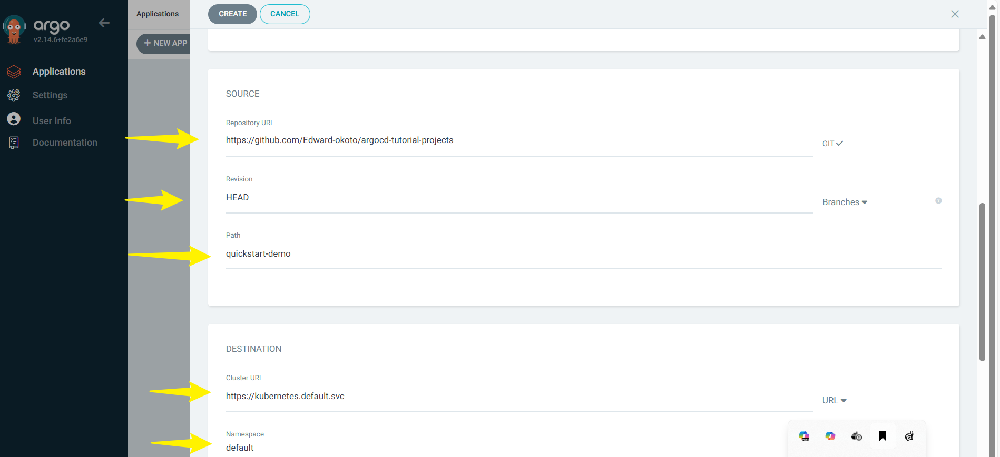

## Introduction-To-Gitops-and-ArgoCD

#### Introduction-To-Gitops-and-ArgoCD using AWS

#### **Introduction to GitOps & ArgoCD**

In modern cloud-native environments, **GitOps** has become the preferred approach for managing Kubernetes deployments, offering version-controlled infrastructure and automated workflows. **ArgoCD**, a powerful GitOps tool, enhances deployment management by providing declarative, automated synchronization between **Git repositories** and **Kubernetes clusters**.

---

#### **What is GitOps?**
GitOps is a **devops methodology** that uses **Git as the single source of truth** for managing Kubernetes infrastructure and applications. It focuses on declarative configurations stored in Git and enables automation through pull-based deployment mechanisms.

#### **Core GitOps Principles**
1️⃣ **Declarative Configuration:** Infrastructure and application manifests are version-controlled in Git.  
2️⃣ **Automated Synchronization:** Changes in Git repositories automatically apply to the cluster.  
3️⃣ **Pull-based Deployments:** Kubernetes continuously syncs with Git, ensuring consistency.  
4️⃣ **Version Control & Auditability:** Every deployment is tracked, allowing easy rollbacks.  

✔ GitOps **simplifies operations** by ensuring Kubernetes clusters always match the desired state defined in Git.

---

#### ✅ **What is ArgoCD?**
**ArgoCD** is a **continuous deployment tool** built for GitOps workflows in Kubernetes. It monitors Git repositories for changes and **automatically syncs applications** in Kubernetes clusters.

#### **Key Features of ArgoCD**
✅ **Declarative Git-based deployments**  
✅ **Pull-based continuous synchronization**  
✅ **Role-based access control (RBAC) & authentication**  
✅ **Automated rollbacks & health monitoring**  
✅ **Multi-cluster support**  

✔ **ArgoCD eliminates manual Kubernetes deployment**, making Git the central control mechanism.

---

#### **How GitOps & ArgoCD Work Together**
1️⃣ **Developers push changes** (manifests, Helm charts, Kustomize overlays) to Git.  
2️⃣ **ArgoCD detects changes** and **syncs Kubernetes clusters** to the updated Git state.  
3️⃣ **Continuous reconciliation ensures consistency**, detecting drift and self-healing configurations.  

 This **ensures automated, reliable, and auditable deployments** without direct manual intervention!

---

#### **Benefits of GitOps**
GitOps revolutionizes **Kubernetes application deployment** by making infrastructure management **more secure, automated, and scalable**. Here’s why GitOps is widely adopted:

---

##### ✅ **1. Enhanced Security & Auditability**
GitOps ensures that **every change** in your infrastructure is:
- **Tracked in Git**, providing full history of deployments.
- **Easily auditable**, allowing rollback to previous versions.
- **Prevents unauthorized changes**, as all updates must go through version control.

✔ **Reduces security vulnerabilities** by enforcing consistency.

---

##### ✅ **2. Automates Kubernetes Deployments**
GitOps eliminates manual Kubernetes updates by:
- **Syncing clusters automatically** based on Git state.
- **Detecting and fixing configuration drift** in real-time.
- **Using pull-based deployment models**, improving reliability.

✔ **Ensures infrastructure always matches desired state** without manual intervention.

---

##### ✅ **3. Improves Collaboration & Developer Productivity**
With GitOps:
- Developers manage **Kubernetes as code**, reducing operational overhead.
- Teams work in a **unified, version-controlled environment**.
- Rollbacks are **instantaneous**, allowing quick issue resolution.

✔ **Empowers developers with self-service infrastructure updates**.

---

##### ✅ **4. Simplifies Multi-Cluster & Multi-Cloud Operations**
GitOps enables:
- **Consistent deployment strategies** across multiple clusters.
- **Standardized workflows**, improving multi-cloud compatibility.
- **Easy replication of applications** for redundancy and scaling.

✔ **Makes scaling Kubernetes clusters seamless**.

---

##### ✅ **5. Faster Recovery & Disaster Management**
GitOps provides:
- **Instant rollback options** in case of failures.
- **Self-healing deployments**, ensuring uptime.
- **Automatic re-deployment after crashes**.

✔ **Boosts reliability and disaster recovery speed**.

---

#### **Installing & Configuring ArgoCD in an AWS Kubernetes Environment**  

ArgoCD is a powerful **GitOps tool** that automates Kubernetes application deployment by **syncing clusters to a Git repository**. In this guide, we will install and configure **ArgoCD** in an **AWS Kubernetes (EKS) cluster**, ensuring smooth GitOps-based deployments.

---

##### ✅ **Step 1: Set Up an AWS EKS Cluster**  
If you don't already have an **Amazon EKS (Elastic Kubernetes Service) cluster**, create one using `eksctl`:  

```sh
eksctl create cluster --name my-cluster --region us-east-1 --nodegroup-name workers --nodes 2 --managed
```
✔ Creates an **EKS cluster** with worker nodes.

---

##### ✅ **Step 2: Install ArgoCD in Kubernetes**  
1️⃣ **Create a dedicated namespace for ArgoCD**  
```sh
kubectl create namespace argocd
```

2️⃣ **Deploy ArgoCD using its official manifests**  
```sh
kubectl apply -n argocd -f https://raw.githubusercontent.com/argoproj/argo-cd/stable/manifests/install.yaml
```

3️⃣ **Verify ArgoCD installation**  
```sh
kubectl get pods -n argocd
```
✔ Ensures **ArgoCD components are running properly**.


---

##### ✅ **Step 3: Expose the ArgoCD Server**  
Since ArgoCD runs as a **Kubernetes service**, we need to expose it to access its **Web UI**.

1️⃣ **Expose ArgoCD Server via Port Forwarding**  
```sh
kubectl port-forward svc/argocd-server -n argocd 8080:443
```


✔ Allows **local access** to the ArgoCD dashboard.

---

##### ✅ **Step 4: Retrieve ArgoCD Admin Password & Login**  
ArgoCD generates a **default admin password**, stored in a Kubernetes secret.

1️⃣ **Get the ArgoCD Admin Password**  
```sh
kubectl get secret argocd-initial-admin-secret -n argocd -o jsonpath="{.data.password}" | base64 --decode
```


**Loggin ArgoCD UI**

**username** = admin

**password** = < Your-Retreived-Secret >


## ArgoCD Architecture

Argo CD follows a **component-based architecture** designed for **declarative GitOps continuous delivery** in Kubernetes. Here are its **core components**:

#### **1️⃣ API Server**
- Acts as the **central hub** for Argo CD.
- Exposes a **gRPC/REST API** used by the **Web UI, CLI, and CI/CD systems**.
- Handles **authentication, RBAC enforcement, and Git webhook events**.

#### **2️⃣ Repository Server**
- Maintains a **local cache** of the Git repository holding Kubernetes manifests.
- Generates and returns Kubernetes manifests based on:
  - **Repository URL**
  - **Branch, tag, or commit**
  - **Application path and Helm values**.

#### **3️⃣ Application Controller**
- Continuously **monitors applications** in Kubernetes.
- Compares the **live state** vs. the **desired state** (from Git).
- Detects **OutOfSync** states and **automatically syncs** changes.
- Handles **lifecycle hooks** (PreSync, Sync, PostSync) for deployments.

#### **4️⃣ Web UI**
- Provides a **visual dashboard** for managing applications.
- Displays **sync status, health checks, and deployment history**.

#### **5️⃣ CLI**
- Allows users to **interact with Argo CD** via command-line.
- Supports **automation and scripting** for GitOps workflows.

### **Summary**
✅ **API Server** → Manages authentication & API requests.  
✅ **Repository Server** → Caches Git repositories & generates manifests.  
✅ **Application Controller** → Monitors & syncs applications.  
✅ **Web UI** → Provides a graphical interface for managing deployments.  
✅ **CLI** → Enables command-line interaction for automation.  


## Navigate argoCD UI

**sync a Git repository and create an application in Argo CD**, follow these steps:

#### **1️⃣ Access the Argo CD UI**
- Open your browser and go to the **Argo CD UI** (usually something like `https://argocd.yourdomain.com`) or the portforwarded address `127.0.0.1:8080`
- Log in using your **admin credentials**.

---

#### **2️⃣ Sync Argo CD with a Git Repository**
- Click on **"Settings"** from the Argo CD dashboard.
- Click on **"Repositories"** 
- Select **"Connect Repository"**.

    

- Enter the **Git repository URL** (e.g., `https://github.com/your-org/your-repo.git`).
- Choose **authentication method**:
  - **SSH key** (if required, add a private key in GitHub Secrets).
  - **HTTPS with username/password**.
  - **OAuth token** (recommended for security).
- Click **"Save"** to establish a connection.

    

---

#### **3️⃣ Create an Application in Argo CD**
- Go to **"Applications"** → Click **"Create Application"**.
- Fill in the details:
  - **Application Name**: `kustomize-capstone`
  - **Project**: Choose an appropriate project (default: `default`).
  - **Source Type**: Select **Git**.
  - **Repository URL**: The synced Git repo.
  - **Revision**: Choose a branch (e.g., `main`).
  - **Path**: Define the path to Kubernetes manifests (e.g., `overlays/prod` for Kustomize).
- Click **"Next"**.

    
---

## Deploying a Sample Application

Demo-project for demonstration :  https://github.com/Edward-okoto/argocd-tutorial-projects


To **sync a Git repository and create an application in Argo CD**, follow these steps:

---

### **Sync Argo CD with a Git Repository above**
- Click on **"Repositories"** from the Argo CD dashboard.
- Select **"Connect Repository"**.
- Enter the **Git repository URL** `https://github.com/Edward-okoto/argocd-tutorial-projects`.

- Choose **authentication method**:
  - **SSH key** (if required, add a private key in GitHub Secrets).
  - **HTTPS with username/password**.
  - **OAuth token** (recommended for security).
- Click **"Save"** to establish a connection.

 
---

#### **Create an Application in Argo CD**
- Go to **"Applications"** → Click **"Create Application"**.
- Fill in the details:
  - **Application Name**: `demo-nginx-webapp`
  - **Project**: Choose an appropriate project (default: `default`).
  - **Source Type**: Select **Git**.
  - **Repository URL**: The synced Git repo.
  - **Revision**: Choose a branch (e.g., `main`).
  - **Path**: Define the path to Kubernetes manifests `quickstart-demo`
  - **Cluster**: Your Kubernetes cluster (e.g., `https://kubernetes.default.svc`).
  - **Namespace**: `default`.

 **Configure Sync Policy & Deploy**
  - Set **Sync Policy**:
  - **Manual:** Requires clicking "Sync" every time.
  - **Automated:** Auto-syncs new changes.
  - Click **"Create"** → Go to the application → Click **"Sync"**.

  
  
---

### **Verify Deployment**
- Once synced, **check the application status** in the Argo CD UI.
- Click on the **app name** → Verify pod and service statuses.

  
  


## Using the argoCD CLI instead


 **Login to ArgoCD CLI**  
```sh
argocd login localhost:8080 --username admin --password <retrieved-password>
```
✔ Ensures **you’re authenticated to manage applications**.

---

##### ✅ ** Connect ArgoCD to a Git Repository**  
Now, configure ArgoCD to **sync with your GitOps repository**.

1️⃣ **Register the EKS cluster with ArgoCD**  
```sh
argocd cluster add my-cluster
```

2️⃣ **Deploy an application using GitOps**  
```sh
argocd app create my-app --repo https://github.com/your-repo.git --path kustomize/base --dest-namespace default --dest-server https://kubernetes.default.svc
```
✔ **ArgoCD will automatically sync Kubernetes manifests**.

---

##### ✅ ** Monitor & Sync Applications**  
Check the **sync status** of your deployments:  
```sh
argocd app list
```

To manually **sync applications**, run:  
```sh
argocd app sync my-app
```
✔ **Automatically applies updates from Git to the Kubernetes cluster**.


